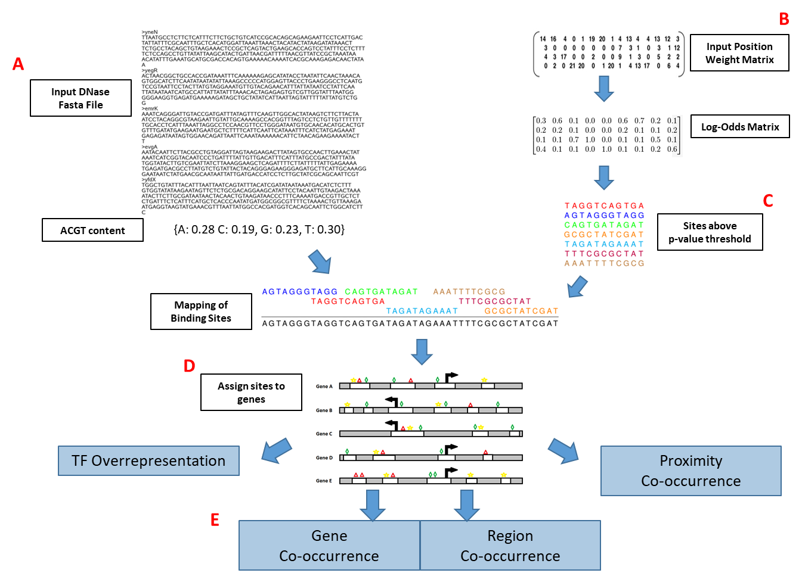

# TF-SCORE

TF-SCORE is a command-line tool that can be used for the identification of over-represented transcription factor binding patterns within a gene list of interest. This program utilizes open chromatin information to map potential transcription factor binding sites with the help of position weight matrices (PWMs). The use of open chromatin data decreases the false positive rate of PWMs and allows for cell-type specific identification of the cis-regulatory elements near the provided gene set.

(A) Open chromatin information needs to be provided by the user in the form of a fasta file. This information can come from various types of next-generation sequencing data (ATAC-seq, DNase-seq, FAIRE-seq, etc). (B) Input PWMs from the JASPAR database are provided with the program, but additional PWMs can be provided as long as they fit the input format. (C) The Motif Occurrence Detection Suite (MOODS) uses the PWMs from (B) and the DNA sequences from (A) to produce putative TF binding sites that pass the user provided p-value threshold for stringency. (D) TF-SCORE provides a base background set of genes with their TSS information, but the user can provide their own gene and TSS information if they want to use a different background set. Then the mapped putative binding sites from (C) are assigned to genes based on the user provided upstream and downstream distances. (E) Once the putative TF binding sites are mapped to genes, the gene set of interest can be compared to the background set to search for single TF overrepresentation, gene co-occurrence, open region co-occurrence, and proximity co-occurrence of the provided TF PWMs.
