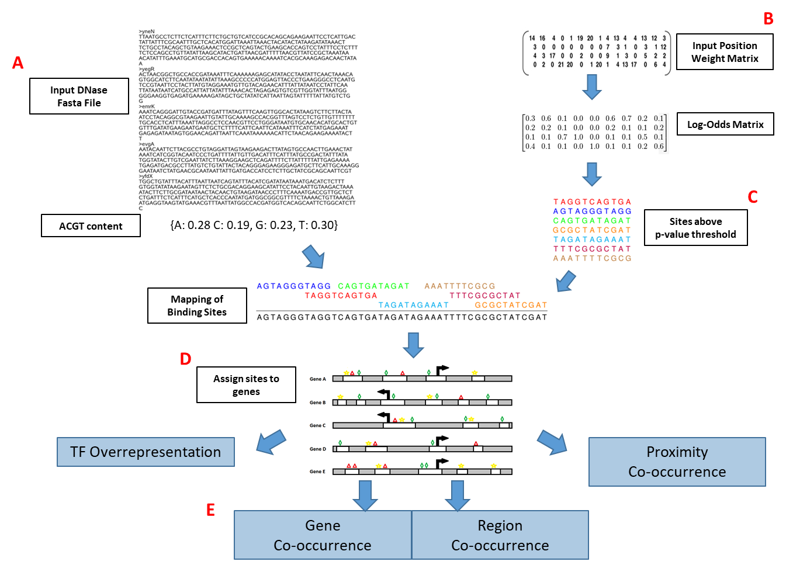

# TF-SCORE Overview

**_T_**ranscription **_F_**actor **_S_**earch for **_CO_**mbinatorial **_RE_**gulation (TF-SCORE) is a command-line tool that can be used for the identification of over-represented transcription factor binding patterns within a gene list of interest. This program utilizes open chromatin information to map potential transcription factor binding sites with the help of position weight matrices (PWMs). The use of open chromatin data decreases the false positive rate of PWMs and allows for cell-type specific identification of the cis-regulatory elements near genes in the provided set.



(A) Open chromatin information needs to be provided by the user in the form of a fasta file. This information can come from various types of next-generation sequencing data (ATAC-seq, DNase-seq, FAIRE-seq, etc). (B) Input PWMs from the JASPAR database are provided with the program, but additional PWMs can be provided as long as they fit the input format. (C) The Motif Occurrence Detection Suite (MOODS) uses the PWMs from (B) and the DNA sequences from (A) to produce putative TF binding sites that pass the user provided p-value threshold for stringency. (D) TF-SCORE provides a background set of genes with their TSS information, but the user can provide their own gene and TSS information if desired. Then the mapped putative binding sites from (C) are assigned to genes based on the user provided upstream and downstream distances. (E) Once the putative TF binding sites are mapped to genes, the gene set of interest can be compared to the background set to search for single TF overrepresentation, gene co-occurrence, open region co-occurrence, and proximity co-occurrence of the provided TF PWMs.

# TF-SCORE Tutorial

This section functions as a step-by-step tutorial for how to run TF-SCORE to identify putative transcription factor enrichment. This program was created and validated using python 2.7 and has not been tested on other versions of python. To run TF-SCORE the user needs to provide several different files: a bed or fasta file of open DNA regions, PWM files (the JASPAR non-redundant core vertebrate motifs are provided here), a gene list of interest, and a background gene list.  

1. A fasta file is needed that contains the open chromatin sequences for the cell type of interest, but a bed file can be provided if no fasta is available. Step 2. demonstrates how to convert a bed file to a fasta file. 

2. A bed file can be converted to a fasta file with the help of bedtools or the table browser function from the UCSC genome browser. Below is an outline of how bedtools can be used to generate a fasta file from a bed file.

```
bedtools getfasta -fi [input fasta file to pull sequences from] -bed [bed file of regions to get DNA for] -fo [name of output fasta file]
```

Example usage:

```
bedtools getfasta -fi genome.fa -bed PC3_DNase_hg19.bed -fo PC3_DNase_hg19.fasta
```

3. Next a directory containing Jaspar formatted position weight matrices needs to be generated to use for mapping putative TF binding sites to the fasta file sequences.

The file format for each PWM looks like the following:

|       | pos 1 | pos 2 | pos 3 | pos 4 | pos 5 | pos 6 | pos 7 | pos 8 | pos 9 | pos 10| pos 11|
|:-----:|:-----:|:-----:|:-----:|:-----:|:-----:|:-----:|:-----:|:-----:|:-----:|:-----:|:-----:|
| **A** |  287  |  234  |  123  |  57   |  0    |  87   |  0    |  17   |  10   |  131  |  500  |
| **C** |  496  |  485  |  1072 |  0    |  75   |  127  |  0    |  42   |  400  |  463  |  158  |
| **G** |  696  |  467  |  149  |  7    |  1872 |  70   |  1987 |   848 |  251  |  81   |  289  |
| **T** |  521  |  814  |  656  |  1936 |   53  |  1716 |   13  |   93  |  1339 |  1325 |  1053 |

The row order is A, C, G, T and each column represents a specific location within the TFs consensus binding site. **Note that the row headers (A, C, G, T) and position headers (pos 1, pos 2, etc) are not included in the PWM files, they are only used here for demonstration purposes. The file should only contain tab-delimited numbers.** 

4. A single JASPAR file that contains all of the human based PWM files (JASPARhumanPWM.txt) can be filtered by a python program called MatrixFileSeparator.py to generate individual files for all of the PWMs contained within the master file. Once all of the individual PWM files are created, they should be stored within a single directory.

Below is an example of how MatrixFileSeparator.py is used to convert the master JASPAR PWM file into separate PWM files:

```
python MatrixFileSeparator.py -f JASPARhumanPWM.txt
```

5. A python program, PWMsearch.py, based on the MOODS program is used to call binding sites for each PWM within the sequences of the provided fasta file. The output is reported in the following format:

	chr10   15111077        15111088        GCCTGTGGGTA     p       7.799003

	chr5    145428864       145428875       ATCTGTGGGTT     p       8.377261

	chr2    223966690       223966701       CCCTGTGGTTC     m       7.986555
	
	column 1: chromosome #

	column 2: start of the binding site

	column 3: end of the binding site

	column 4: called binding site sequence

	column 5: directionality of the binding site on DNA

	column 6: log likelihood score of the binding site (This column is optional and not necessary for later program usage, but it can be useful for identifying cutoff values for putative binding site calling)
	
Usage:

```
python PWMsearch.py [options]
	-f 	Fasta file to search for binding sites
	-p 	Position weight matrix directory path
	-t 	p-value threshold to give MOODS for putative binding site determination
	-o 	Path and name of the output file directory
```

6. A small python program, BackgroundGeneGenerator_final.py, is used to create a background file that contains information on how much open DNA is mapped to each gene given the upstream and downstream distances that are considered to house regulatory sequences. This file is used for the statistical analyses that occur later.
	Note: This background file needs to be specific for the provided regulatory distance upstream and downstream of the TSSs that will be used for the later enrichment calculations.

Usage:

```
python BackgroundGeneGenerator_final.py [options]
	-u 	Upstream distance from the TSS to consider for mapping an open region to a gene
	-d	Downstream distance from the TSS to consider for mapping an open region to a gene
	-i 	Input bed file or fasta file that contains the information for the location of the open regions
	-f 	Add this option if -i represents a fasta file (with headers in the format chr#: start-stop)
 	-o 	Output file name
	-a 	Annotation file with TSS sites to consider for each gene or transcript of interest
```
Required format for the provided annotation (-a) file:

column 1	 gene/transcript ID

column 2 	chromosome #

column 3 	nucleotide number of TSS on chromosome

column 4	 direction of transcript on DNA

7. Generate a file that contains a list of all of the TFs that shouldn't be compared to each other in the pairwise comparison. This is needed to prevent TFs that bind very similar sequences on DNA from being compared against each other for co-occurrence enrichment.

Note: This file can be generated based on prior knowledge by the user or a program such as Matalign can be used to determine which PWMs would produce significant overlap

Below is an outline for how Matalign can be utilized to produce the non-comparison PWM file. This section also provides an explanation of how the Matalign output is converted to a format that is usable by TF-SCORE.

Matalign requires a directory full of individual PWM files with the format below. **Note this is not the default format of JASPAR PWMs that are input into TF-SCORE. The TF-SCORE PWMS don't contain the A, C, G, T characters or the pipe characters.**

| | | | | | | | | | | | |
|-|-|-|-|-|-|-|-|-|-|-|-|
|  \|A\|  |  366  |  0    |  0    |  361  |  109  |  1739  |  163  |  29   |  3620  |  3624  |
|  \|C\|  |  731  |  52   |  6    |  3262 |  2009 |  0     |  0    |  7    |  0     |  5     |
|  \|G\|  |  785  |  0    |  110  |  6    |  0    |  1637  |  3466 |  3426 |  9     |  0     |
|  \|T\|  |  1747 |  3577 |  3513 |  0    |  1511 |  253   |  0    |  167  |   0    |  0     |

A python program, MatrixFileSeparator_Matalign.py, can take the JASPAR formatted all human PWM file and create PWMs in the required format for use by Matalign.

Usage:

```
python MatrixFileSeparator_Matalign.py -f JASPARhumanPWM.txt
```

Note: It is recommended that this program is run in an empty directory so the individual PWM files can be output directly into this directory.

Matalign notes: To run Matalign a list of all of the PWMs that will be pairwise compared against each other is needed. To obtain this list from a unix based terminal, the command below can be used in the directory with all of the PWM files (assuming they are .pfm files):

```
ls *.pfm > SampleList.txt
```

The first line of the file needs to list the directory location that contains all of the sample files, so this can be added to the first line of SampleList.txt. Finally to run Matalign an alphabet file is required that lists the relative ratio of A:T and C:G nucleotides in the provided user sequences. For the validation tests on this program the alphabet file was A:T .27 and C:G .23. Once all of the preliminary files are created above, Matalign can be run on the PWM files to compare their binding similarity.

Usage:
```
./matalign-v4a -f1 SampleList.txt -a alphabet -g > Matalign_similarity_output.txt
```

The output contains every pairwise comparison of the provided PWMs with several statistical values for each comparison. These values can be used to decide which pairs of PWMs are too similar to be compared in TF-SCORE. 

To utilize the same cutoff criteria as was utilized throughout the trial runs of this program, a small program called Matalign_file_parser.py will take the matalign output file and convert it into the no comparison file format based on the following criteria:

if Evalue < 0.15 and (overlap > 0.4*TFA_length or overlap > 0.4*TFB_length)
	
Note: The overlap value comes from column 6 and E-value comes from column 10 of the Matalign output
The output format of the no comparison file is as follows:

MA0102.3_CEBPA.pfm      MA0046.1_HNF1A.pfm
			
MA0102.3_CEBPA.pfm      MA0466.1_CEBPB.pfm
			
MA0462.1_BATF::JUN.pfm  MA0099.2_JUN::FOS.pfm
			
8. It is now possible to create a gene list and run it in through TF-SCORE to search for transcription factor overrepresentation and co-occurrence in the gene of interest list versus the background list.
Required input files:

1. Gene of interest (GoI) list with each gene on its own line (same gene IDs as the TSS list)
	
2. Background Gene list (generated in step 5)
	
3. Directory with all of the TF binding site files
	
4. Matalign or non-comparison TF output file (used to remove comparisons of TFs that are expected to bind similar sites based on PWM)
	
5. TSS file used to create the Background Gene file
	
Expected output files:

	1. Single TF overrepresentation in GoI
	
	2. Gene Cooccurrence of TFs for the genes contained in the GoI set
	
	3. Region Cooccurrence of TFs within the open regions that mapped to genes within the GoI set
	
	4. Proximity Coccurrence of TFs based on a variety of variables (within 50 bp, few base pair overlap - 10 bp, 11 - 25 bp, and 26 - 50 bp)
	
	
Usage:

```
python TF-SCORE.py [options]
	-i 	TSS file used in generation of background genes
	-d 	Directory location for the binding sites from each PWM
	-u 	Upstream distance from TSS to consider for mapping an open region to a gene
	-do 	Downstream distance from TSS to consider for mapping an open region to a gene
	-g 	Genes of interest file
	-b 	Background Gene file (generated in step 5)
	-s	 PWM non-comparison file (generated in step 6 from Matalign)
	-o 	Single TF overrepresentation output name
	-gc 	Gene Cooccurrence output name
	-rc 	Region Cooccurrence output name
	-pc 	Proximity Coccurrence output name

